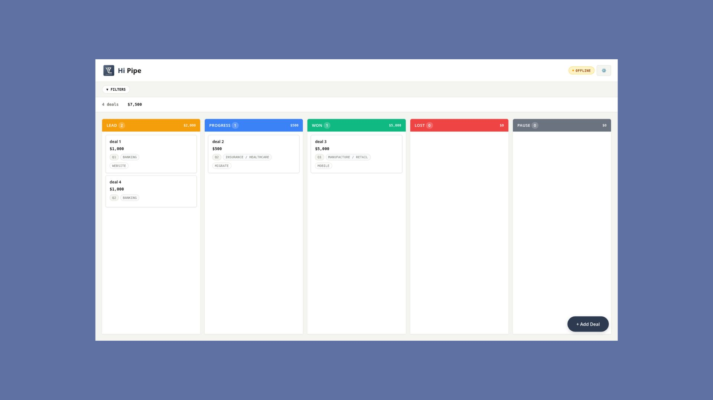
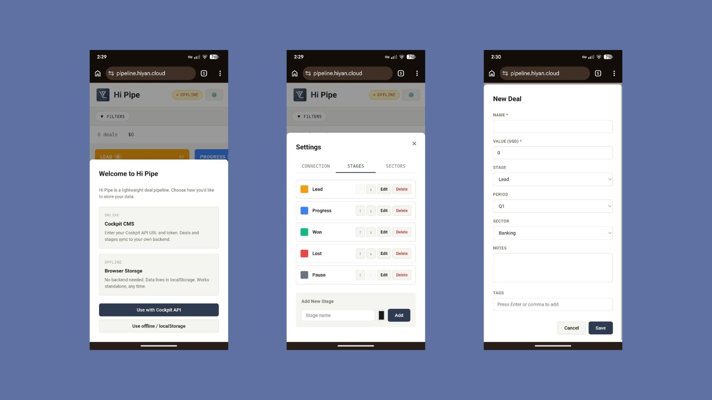

# Hi Pipe

## Live Application
Access Hi Pipe at: [pipe.hiyan.cloud](https://pipe.hiyan.cloud)

## How to Use
1. Visit the app URL above
2. Log in with your credentials
3. View deals organized by stage
4. Click deals to edit, drag between stages to move them
5. Use filters to focus on specific deals

## Screenshots

### Main Board View


### Deal Management


## Features
- Visual kanban board for sales pipeline
- Drag and drop deal cards between stages
- Filter by period, sector, or tags
- Real-time totals per stage
- Works offline with automatic sync
- Installable as web app

## Development
```bash
git clone https://github.com/mrlinnth/hi-pipe.git
cd hi-pipe
cp .env.example .env
npm install
npm run dev
```

## Tech Stack
- React 18 + Vite
- Cockpit CMS API
- Plain CSS
- Docker + Nginx

## Environment Variables
Required in `.env`:
```
VITE_COCKPIT_API_URL=https://cms.hiyan.xyz/:hi-pipe/api
VITE_COCKPIT_API_KEY=your_api_key_here
```

## Project Structure
```
hi-pipe/
├── src/
│   ├── components/    # React components
│   ├── hooks/         # Custom hooks
│   ├── api/           # Cockpit API client
│   ├── constants/     # Hardcoded values
│   ├── styles/        # CSS
│   ├── App.jsx        # Main application
│   └── main.jsx       # React entry point
├── public/
│   ├── ss-1.jpg       # Main board screenshot
│   └── ss-2.jpg       # Deal management screenshot
├── docker-compose.yml
├── nginx.conf
└── README.md
```

## Running with Docker
```bash
docker-compose up --build
```
Access at `http://localhost:3200`

## License
Internal use only.